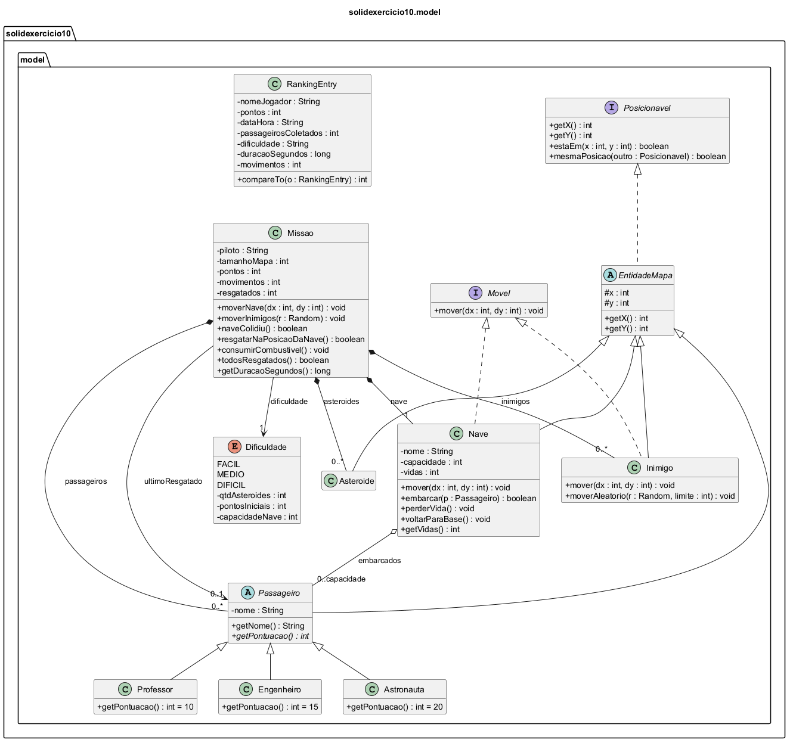
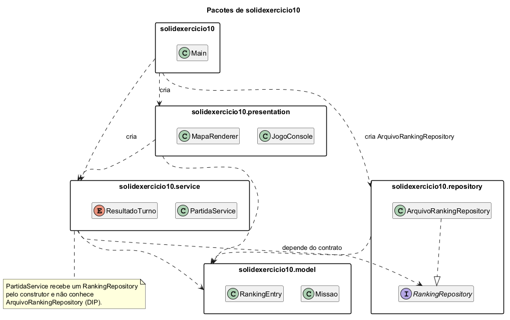

# 🚀 Missão Espacial: Pouso Lunar

Trabalho realizado por:

- João Pedro Nobre Sousa
- Paulo Levi Fontes Furtado


Um jogo de nave em ambiente de terminal desenvolvido em Java, onde o jogador pilota uma nave espacial por um mapa bidimensional, desvia de asteroides e inimigos com IA, resgata astronautas, professores e engenheiros, e realiza um pouso estratégico na plataforma central.

---

## 📋 Sumário

- [Visão Geral](#-visão-geral)
- [Funcionalidades](#-funcionalidades)
- [Mapeamento Visual](#-mapeamento-visual)
- [Sistema de Pontuação](#-sistema-de-pontuação)
- [Níveis de Dificuldade](#-níveis-de-dificuldade)
- [Estrutura do Projeto](#-estrutura-do-projeto)
- [Como Executar](#-como-executar)
- [Regras da Fase de Pouso](#-regras-da-fase-de-pouso)
- [Persistência de Dados (Ranking)](#-persistência-de-dados-ranking)

---

## 🌌 Visão Geral

O projeto consiste na consolidação de conceitos de **Orientação a Objetos em Java** (Herança, Polimorfismo, Enums, Encapsulamento), controle de fluxo e manipulação de arquivos (JSON). 

O objetivo do jogador é salvar todos os passageiros espalhados pelo setor espacial e retornar com segurança à **Plataforma de Pouso `(0, 0)`** antes que seu combustível se esgote ou que suas vidas acabem devido a colisões.

---

## ✨ Funcionalidades

- **Menu Interativo**: Opções para iniciar missão, visualizar Top 5 do ranking, resetar histórico e sair.
- **Diferentes Tipos de Passageiros**: Classes especializadas (`Astronauta`, `Engenheiro`, `Professor`) herdando de `Passageiro`, cada qual com sua pontuação bônus.
- **Sistema de Vidas e Colisão**: A nave possui vidas limitadas. Colisões com asteroides ou inimigos consomem 1 vida e retornam a nave ao ponto de origem.
- **Inimigos com Movimentação Dinâmica (IA)**: Inimigos que se deslocam aleatoriamente pelo mapa a cada turno do jogador.
- **Mapa Expansível e Customizável**: O jogador escolhe o tamanho do setor espacial antes da partida.
- **Fase de Pouso e Decolagem Estilo Pouso Lunar**: Após resgatar a tripulação, a nave precisa regressar à coordenada `(0, 0)`. Cada movimento consome combustível.
- **Métricas e Recordes**: Gravação de tempo de jogo (segundos), total de movimentos, passageiros resgatados, dificuldade e data/hora.
- **Ranking Persistente**: Leitura e gravação de histórico de partidas em formato JSON (`ranking.json`).

---

## 🗺️ Mapeamento Visual

O mapa é impresso no console utilizando caracteres específicos:

| Símbolo | Descrição |
| :---: | :--- |
| `@` | Nave espacial piloted pelo jogador |
| `P` | Passageiro a ser resgatado |
| `#` | Asteroide (obstáculo fixo) |
| `X` | Inimigo (obstáculo móvel) |
| `L` | Plataforma de Pouso (*Landing Pad*) na coordenada `(0, 0)` |
| `.` | Espaço livre/Vazio |

---

## 🏆 Sistema de Pontuação

Cada tipo de passageiro fornece uma quantidade de pontos bônus diferente ao embarcar:

| Passageiro | Classe Java | Pontos Bônus |
| :--- | :--- | :---: |
| **Professor** | `Professor` | `+10` |
| **Engenheiro** | `Engenheiro` | `+15` |
| **Astronauta** | `Astronauta` | `+20` |

---

## ⚙️ Níveis de Dificuldade

O jogo utiliza uma `enum Dificuldade` para definir os parâmetros da missão:

| Nível | Pontos Iniciais / Combustível | Vagas na Nave | Asteroides |
| :--- | :---: | :---: | :---: |
| **Fácil** | 30 | 5 | 5 |
| **Médio** | 20 | 5 | 3 |
| **Difícil** | 15 | 5 | 6 |

---

## 🛠️ Estrutura do Projeto

```text
src/
└── missao/
    ├── Asteroide.java      # Representa os obstáculos fixos
    ├── Astronauta.java     # Subclasse de Passageiro (+20 pts)
    ├── Dificuldade.java    # Enum de facilidades e parâmetros
    ├── Engenheiro.java     # Subclasse de Passageiro (+15 pts)
    ├── Inimigo.java        # Representa inimigos que se movem a cada turno
    ├── Main.java           # Loop do jogo, menus, persistência e estatísticas
    ├── Missao.java         # Gerencia mapa, colisões e verificação de resgates
    ├── Nave.java           # Atributos da nave (posição, capacidade, vidas)
    ├── Passageiro.java     # Classe base para os resgatáveis
    ├── Professor.java      # Subclasse de Passageiro (+10 pts)
    └── RankingEntry.java   # Modelo e formatação JSON do ranking
```

---

## 🎮 Como Executar

### Pré-requisitos
- **Java Development Kit (JDK) 11** ou superior instalado.
- Terminal / Prompt de Comando / IDE Java (Eclipse, IntelliJ, VS Code).

### Passos
1. Compile os arquivos fonte dentro do diretório `src`:
   ```bash
   javac missao/*.java
   ```

2. Execute a classe principal `Main`:
   ```bash
   java missao.Main
   ```

3. Controles do Jogo:
   - `W`: Mover para Cima
   - `S`: Mover para Baixo
   - `A`: Mover para a Esquerda
   - `D`: Mover para a Direita
   - `Q`: Desistir / Sair da partida

---

## 🌕 Regras da Fase de Pouso

1. **Fase 1 (Resgate)**: Navegue pelo mapa e posicione a nave sobre a mesma coordenada dos passageiros `P`.
2. **Fase 2 (Pouso)**: Quando todos os passageiros estiverem a bordo, o alerta de pouso é acionado.
3. **Consumo de Combustível**: Durante o retorno, **cada movimento consome 1 ponto de combustível**.
4. **Condição de Vitória**: Chegar à Plataforma `L` em `(0, 0)` com combustível `> 0` e pelo menos `1` vida restante.

---

## 📊 Persistência de Dados (Ranking)

As estatísticas são gravadas automaticamente no arquivo `ranking.json` ao final de cada vitória:

```json
{"nome":"PilotoYuri","pontos":45,"dataHora":"2026-08-26 14:30:00","passageiros":5,"dificuldade":"MEDIO","duracao":42,"movimentos":28}
```

O jogo também realiza a leitura do ranking para listar o **Top 5 Pilotos** em ordem decrescente de pontuação.

---

## ♻️ Versão Refatorada (SOLID) — `solidexercicio10`

A versão refatorada fica em `src/solidexercicio10/` e **não altera** o código original em `src/`.

```text
src/solidexercicio10/
├── Main.java                         # ponto de entrada e composição das dependências
├── model/                            # entidades e regras do domínio
├── service/                          # PartidaService (fluxo do turno) + ResultadoTurno
├── presentation/                     # JogoConsole (menus/entrada) + MapaRenderer (mapa/status)
└── repository/                       # RankingRepository (contrato) + ArquivoRankingRepository (JSON)
test/solidexercicio10/PartidaServiceTeste.java
```

Compilar e executar (JDK 8+), a partir da raiz do projeto:

```bash
javac -encoding UTF-8 -d out src/solidexercicio10/*.java src/solidexercicio10/*/*.java test/solidexercicio10/*.java
java -cp out solidexercicio10.Main
java -cp out solidexercicio10.PartidaServiceTeste
```

Os diagramas foram feitos em PlantUML com o plugin **PlantUML Integration** do IntelliJ. Para regerar os PNGs, abra o `.puml` no IntelliJ e use *Save diagram*.

### Diagrama de classes do domínio

Fonte: [`docs/uml/diagrama-classes-model.puml`](docs/uml/diagrama-classes-model.puml)



- `EntidadeMapa` (abstrata) centraliza a posição e realiza `Posicionavel`; todas as coisas do mapa herdam dela.
- `Passageiro` é abstrata com `getPontuacao()` abstrato: cada subclasse só define o bônus (OCP/LSP).
- `Movel` é implementada apenas por quem se move (`Nave`, `Inimigo`); `Asteroide` não recebe um `mover` inútil (ISP).
- `Missao` **compõe** a `Nave` (1) e as listas de passageiros, asteroides e inimigos (0..*); a `Nave` **agrega** os passageiros embarcados.
- `Dificuldade` é um enum com os parâmetros da partida.

### Diagrama de pacotes

Fonte: [`docs/uml/diagrama-pacotes.puml`](docs/uml/diagrama-pacotes.puml)



- As dependências apontam para dentro: `presentation → service → model`.
- `service` depende apenas da interface `RankingRepository`; só o `Main` conhece `ArquivoRankingRepository` (DIP).
- A revisão crítica está em [`REVISAO-SOLID.md`](REVISAO-SOLID.md).
